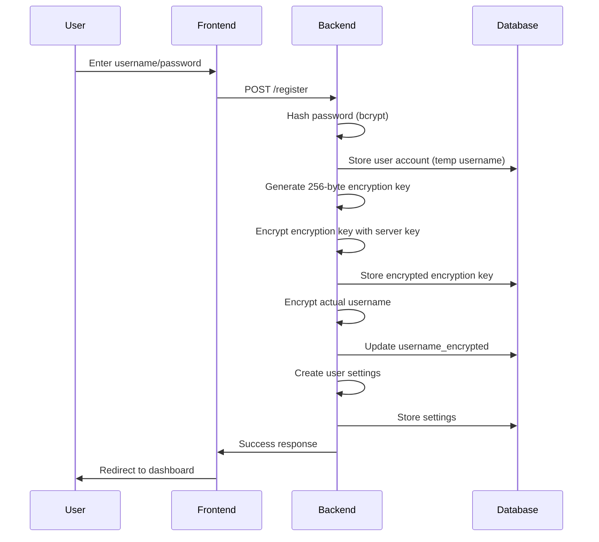
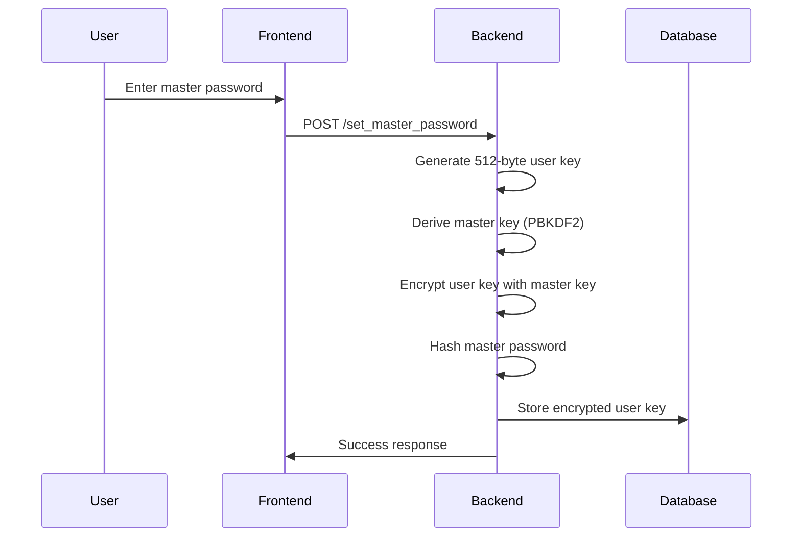
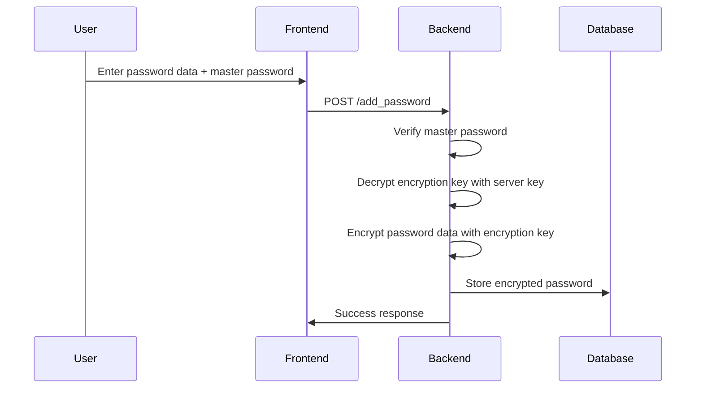
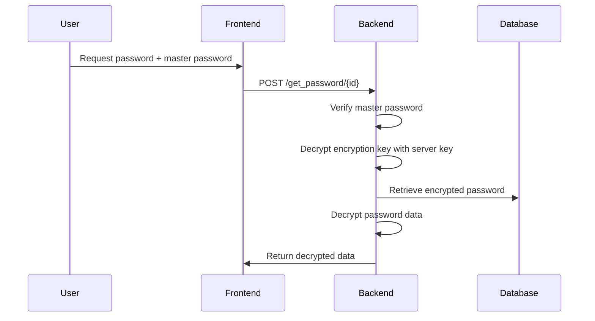
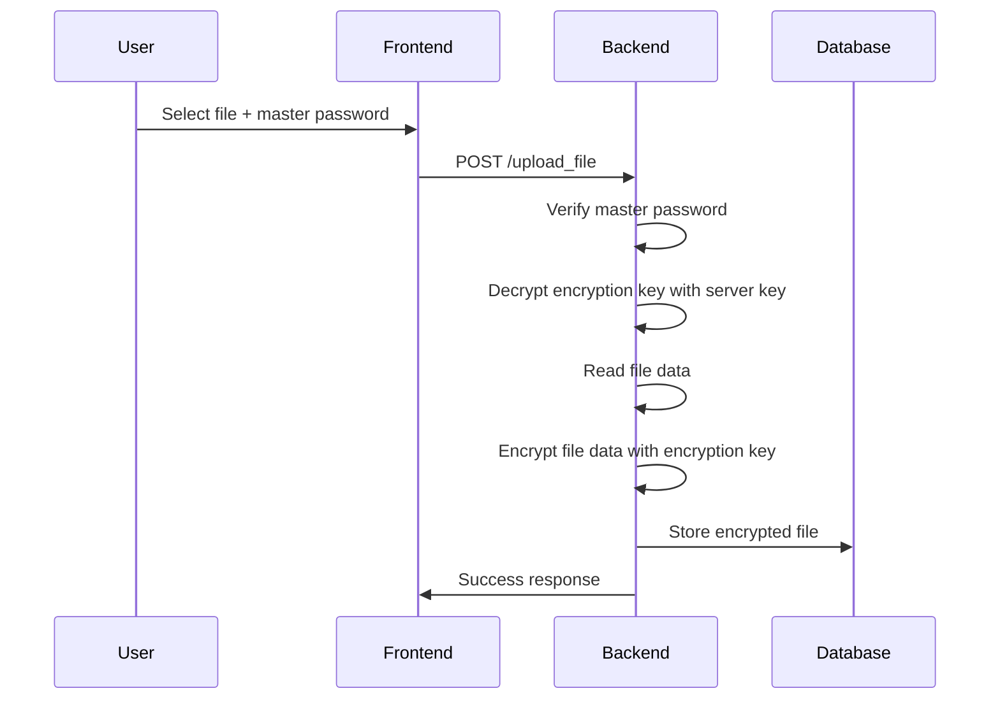

# BattleCell Security - Technical Documentation

## Table of Contents
1. [Overview](#overview)
2. [Architecture](#architecture)
3. [Security Model](#security-model)
4. [Encryption Flow](#encryption-flow)
5. [Database Schema](#database-schema)
6. [API Endpoints](#api-endpoints)
7. [Frontend Components](#frontend-components)
8. [Security Features](#security-features)
9. [Error Resilience](#error-resilience)
10. [Deployment](#deployment)

## Overview

BattleCell Security is a secure password and file storage application built with Flask, featuring a three-level encryption system, master password protection, and secure file handling. The application provides a comprehensive security solution for storing sensitive data with multiple layers of encryption and robust error handling.

### Key Features
- **Three-Level Encryption System**: Server key + random encryption key + master password
- **Random Encryption Keys**: Unique 256-byte key for each user
- **Client-Side Encryption**: All data encrypted before storage
- **Secure File Storage**: Encrypted file upload/download
- **Password Generator**: Built-in secure password generation
- **Error Resilience**: Graceful handling of decryption errors

## Architecture

### Technology Stack
- **Backend**: Flask (Python)
- **Database**: SQLite with encrypted storage
- **Frontend**: HTML5, CSS3, JavaScript (Vanilla)
- **Encryption**: Cryptography library (Fernet + PBKDF2)
- **Authentication**: Flask-Login
- **File Handling**: Werkzeug secure filename

### System Architecture
```
┌─────────────────┐    ┌─────────────────┐    ┌─────────────────┐
│   Frontend      │    │   Backend       │    │   Database      │
│   (Browser)     │◄──►│   (Flask)       │◄──►│   (SQLite)      │
└─────────────────┘    └─────────────────┘    └─────────────────┘
         │                       │                       │
         │                       │                       │
    ┌─────────┐            ┌─────────┐            ┌─────────┐
    │Encryption│            │Session  │            │Encrypted│
    │(Client) │            │Mgmt     │            │Storage  │
    └─────────┘            └─────────┘            └─────────┘
```

## Security Model

### Three-Level Security Architecture

1. **Server Level Security**
   - Server encryption key for protecting user encryption keys
   - Data isolation between users
   - Protection against unauthorized access

2. **Random Encryption Key Level**
   - Unique 256-byte key for each user
   - Encryption with server key
   - Storage in separate `encryption_keys` table

3. **Master Password Level**
   - Separate master password for data encryption
   - PBKDF2 key derivation (200,000 iterations)
   - User key encryption with master password

4. **Data Encryption**
   - Client-side encryption before transmission
   - AES-256 encryption via Fernet
   - Unique encryption keys for each user

### Security Flow
```
User Registration/Login
         │
         ▼
    Account Password Verification
         │
         ▼
    Encryption Key Generation/Retrieval
         │
         ▼
    Master Password Setup/Verification
         │
         ▼
    User Key Generation/Retrieval
         │
         ▼
    Data Encryption/Decryption
```

## Encryption Flow

### 1. User Registration Process



### 2. Master Password Setup



### 3. Password Storage Process



### 4. Password Retrieval Process



### 5. File Storage Process



## Database Schema

### Encryption Keys Table
```sql
CREATE TABLE encryption_keys (
    id INTEGER PRIMARY KEY AUTOINCREMENT,
    user_id INTEGER UNIQUE NOT NULL,
    username TEXT NOT NULL,
    encryption_key BLOB NOT NULL,
    created_at TIMESTAMP DEFAULT CURRENT_TIMESTAMP,
    FOREIGN KEY (user_id) REFERENCES users (id)
);
```

### Users Table
```sql
CREATE TABLE users (
    id INTEGER PRIMARY KEY AUTOINCREMENT,
    username_encrypted BLOB NOT NULL,
    password_hash TEXT NOT NULL,
    master_password_hash TEXT,
    user_key BLOB,
    created_at TIMESTAMP DEFAULT CURRENT_TIMESTAMP
);
```

### Passwords Table
```sql
CREATE TABLE passwords (
    id INTEGER PRIMARY KEY AUTOINCREMENT,
    user_id INTEGER,
    title_encrypted BLOB NOT NULL,
    username_encrypted BLOB NOT NULL,
    password_encrypted BLOB NOT NULL,
    url_encrypted BLOB,
    notes_encrypted BLOB,
    created_at TIMESTAMP DEFAULT CURRENT_TIMESTAMP,
    FOREIGN KEY (user_id) REFERENCES users (id)
);
```

### Files Table
```sql
CREATE TABLE files (
    id INTEGER PRIMARY KEY AUTOINCREMENT,
    user_id INTEGER,
    filename_encrypted BLOB NOT NULL,
    original_filename_encrypted BLOB NOT NULL,
    file_size INTEGER NOT NULL,
    encrypted_data BLOB NOT NULL,
    created_at TIMESTAMP DEFAULT CURRENT_TIMESTAMP,
    FOREIGN KEY (user_id) REFERENCES users (id)
);
```

### User Settings Table
```sql
CREATE TABLE user_settings (
    id INTEGER PRIMARY KEY AUTOINCREMENT,
    user_id INTEGER,
    FOREIGN KEY (user_id) REFERENCES users (id)
);
```

## API Endpoints

### Authentication Endpoints
- `GET /` - Landing page
- `GET /register` - Registration page
- `POST /register` - User registration
- `GET /login` - Login page
- `POST /login` - User authentication
- `GET /logout` - User logout

### Dashboard Endpoints
- `GET /dashboard` - User dashboard
- `GET /passwords` - Password management page
- `GET /files` - File storage page
- `GET /generator` - Password generator
- `GET /settings` - User settings

### Password Management Endpoints
- `POST /set_master_password` - Set master password
- `POST /add_password` - Add new password
- `POST /get_password/<id>` - Retrieve password
- `POST /edit_password/<id>` - Edit password
- `POST /delete_password/<id>` - Delete password

### File Management Endpoints
- `POST /upload_file` - Upload encrypted file
- `POST /download_file/<id>` - Download decrypted file
- `POST /delete_file/<id>` - Delete file

### Settings Endpoints
- `POST /change_master_password` - Change master password
- `POST /change_password` - Change account password
- `POST /change_username` - Change username
- `POST /delete_account` - Delete user account

## Frontend Components

### Modal System
- **Add Password Modal**: Form for adding new passwords
- **Show Password Modal**: Master password verification for viewing
- **Edit Password Modal**: Two-step editing process
- **Delete Password Modal**: Account password verification for deletion
- **File Upload Modal**: File selection and master password
- **File Download Modal**: Master password verification for download
- **File Delete Modal**: Account password verification for deletion

### JavaScript Functions
- `showAddPasswordModal()` - Display add password form
- `editPassword(id)` - Initiate password editing
- `loadPasswordForEdit()` - Load password data for editing
- `savePasswordEdit()` - Save edited password
- `deletePassword(id)` - Initiate password deletion
- `confirmDeletePassword()` - Confirm password deletion
- `uploadFile()` - Handle file upload
- `downloadFile(id)` - Initiate file download
- `deleteFile(id)` - Initiate file deletion

## Security Features

### Password Security
- **Account Password**: Bcrypt hashing (12 rounds)
- **Master Password**: Bcrypt hashing + PBKDF2 derivation
- **User Key**: 512-byte random key encrypted with master password
- **Encryption Key**: 256-byte random key encrypted with server key
- **Data Encryption**: AES-256 via Fernet (first 32 bytes of encryption key)

### Session Security
- **Session Timeout**: Configurable session duration
- **Secure Cookies**: HttpOnly, Secure flags
- **CSRF Protection**: Form-based CSRF tokens

### File Security
- **Secure Filenames**: Werkzeug secure_filename
- **Size Limits**: 500MB maximum file size
- **Storage Quotas**: Per-user storage limits
- **Encrypted Storage**: All file data encrypted

### Input Validation
- **SQL Injection Protection**: Parameterized queries
- **XSS Protection**: Output escaping
- **File Type Validation**: MIME type checking
- **Size Validation**: Client and server-side checks

## Error Resilience

### Decryption Error Handling
- **Graceful degradation**: Display errors instead of application crashes
- **Informative messages**: Clear error descriptions for users
- **Compatibility**: Support for old and new database structures
- **Recovery**: Automatic recovery from errors

### Global Error Handling
```python
@app.errorhandler(500)
def internal_error(error):
    return render_template('error.html', error='Internal server error'), 500

@app.errorhandler(404)
def not_found_error(error):
    return render_template('error.html', error='Page not found'), 404

@app.errorhandler(Exception)
def handle_exception(e):
    return render_template('error.html', error=f'An error occurred: {str(e)}'), 500
```

### Data Decryption Error Handling
- **Passwords**: Display "[Decryption Error]" instead of skipping entries
- **Files**: Display filename with decryption error
- **Settings**: Use default values on errors
- **Logging**: Record errors for diagnostics

### Backward Compatibility
- **Database Schema**: Support for old unencrypted columns
- **Migration**: Automatic migration from old to new structure
- **Fallback**: Graceful fallback to old column names
- **Mixed Data**: Handle mixed old/new data structures

## Deployment

### Requirements
- Python 3.8+
- Flask 2.0+
- Cryptography library
- SQLite3
- Modern web browser

### Installation
```bash
# Clone repository
git clone <repository-url>
cd supercell

# Install dependencies
pip install -r requirements.txt

# Initialize database
python init_db.py

# Run application
python app.py
```

### Migration of Existing Data
```bash
# Migrate to new encryption system
python migrate_db.py
```

### Configuration
- **SECRET_KEY**: Set environment variable for production
- **SERVER_ENCRYPTION_KEY**: Store in secure environment variables
- **UPLOAD_FOLDER**: Configure file storage location
- **MAX_CONTENT_LENGTH**: Set maximum file size
- **Database**: Configure database path and permissions

### Production Considerations
- **HTTPS**: Enable SSL/TLS encryption
- **Database**: Use PostgreSQL for production
- **File Storage**: Use cloud storage (AWS S3, etc.)
- **Logging**: Implement comprehensive logging
- **Monitoring**: Set up application monitoring
- **Backup**: Regular database and file backups
- **Server Key**: Store in secure location (environment variables)

### Security Checklist
- [ ] Change default SECRET_KEY
- [ ] Set secure SERVER_ENCRYPTION_KEY
- [ ] Enable HTTPS
- [ ] Configure secure headers
- [ ] Set up rate limiting
- [ ] Implement audit logging
- [ ] Regular security updates
- [ ] Database encryption at rest
- [ ] Backup encryption

## Encryption Details

### Server Encryption Key
```python
SERVER_ENCRYPTION_KEY = b'supercell-server-key-2024-secure-encryption-system'
```

### Encryption Key Generation
```python
def generate_encryption_key():
    return secrets.token_bytes(256)
```

### User Encryption Key Creation
```python
def create_user_encryption_key(user_id, username):
    encryption_key = generate_encryption_key()
    server_fernet = Fernet(base64.urlsafe_b64encode(SERVER_ENCRYPTION_KEY[:32]))
    encrypted_key = server_fernet.encrypt(encryption_key)
    # Save to database
    return encryption_key
```

### Get Decrypted Encryption Key
```python
def get_decrypted_encryption_key(user_id):
    encrypted_key = get_user_encryption_key(user_id)
    if not encrypted_key:
        return None
    server_fernet = Fernet(base64.urlsafe_b64encode(SERVER_ENCRYPTION_KEY[:32]))
    decrypted_key = server_fernet.decrypt(encrypted_key)
    return decrypted_key
```

### Data Encryption
```python
def encrypt_data(data, user_id):
    encryption_key = get_decrypted_encryption_key(user_id)
    if not encryption_key:
        raise ValueError("Encryption key not found")
    fernet_key = base64.urlsafe_b64encode(encryption_key[:32])
    f = Fernet(fernet_key)
    encrypted_data = f.encrypt(data.encode() if isinstance(data, str) else data)
    return encrypted_data
```

### Data Decryption
```python
def decrypt_data(encrypted_data, user_id):
    encryption_key = get_decrypted_encryption_key(user_id)
    if not encryption_key:
        raise ValueError("Encryption key not found")
    fernet_key = base64.urlsafe_b64encode(encryption_key[:32])
    f = Fernet(fernet_key)
    decrypted_data = f.decrypt(encrypted_data)
    return decrypted_data
```

## Performance Considerations

### Database Optimization
- Indexed user_id columns
- Efficient query patterns
- Connection pooling for production

### Encryption Performance
- PBKDF2 iterations balanced for security/performance
- Efficient key caching
- Minimal re-encryption operations

### File Handling
- Streaming file uploads
- Chunked file processing
- Memory-efficient encryption

## Troubleshooting

### Common Issues
1. **Master Password Errors**: Verify password complexity and length
2. **File Upload Failures**: Check file size and storage space
3. **Session Timeouts**: Adjust session configuration
4. **Database Errors**: Verify database permissions and integrity
5. **Decryption Errors**: Check encryption key integrity
6. **Migration Issues**: Verify database schema compatibility

### Debug Mode
```python
app.run(debug=True, host='0.0.0.0', port=5000)
```

### Logging
- Enable Flask debug logging
- Monitor database operations
- Track encryption/decryption errors
- Log decryption failures for diagnostics

## Future Enhancements

### Planned Features
- Two-factor authentication (2FA)
- Password strength analysis
- Secure sharing between users
- Mobile application
- API for third-party integration
- Advanced file versioning
- Automated backups

### Security Improvements
- Hardware security modules (HSM) integration
- Advanced threat detection
- Behavioral analysis
- Zero-knowledge architecture
- End-to-end encryption verification
- Enhanced error recovery mechanisms
